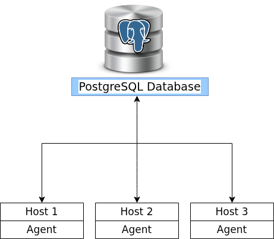

# Linux Cluster Monitoring Agent

## Introduction
The Linux Cluster Monitoring Agent is a monitoring solution designed to collect and store hardware specifications and real-time resource usage data from Linux servers. The project enables centralized monitoring of system performance across multiple hosts in a Linux cluster.

This solution is intended for system administrators, DevOps engineers, and backend developers who need visibility into CPU and memory utilization for operational analysis. Each Linux host runs monitoring scripts that collect system metrics and insert the data into a PostgreSQL database.

The project is implemented using Bash scripts for data collection, Docker to run PostgreSQL, Git for version control, and cron jobs to automate periodic execution. The design focuses on automation, reliability, and simplicity while demonstrating practical infrastructure and scripting skills.

---

## Quick Start


### Navigate to project directory
```
cd /home/centos/dev/jarvis_data_eng_firstname/linux_sql
```
### Start PostgreSQL instance using Docker
```
./scripts/psql_docker.sh create postgres password
```
### Create database tables
```
psql -h localhost -U postgres -d host_agent -f sql/ddl.sql
```
### Insert hardware specification data
```
./scripts/host_info.sh
```
### Insert hardware usage data
```
./scripts/host_usage.sh
```
### Set up cron job
```
crontab -e
```

## Implementation
### Architecture
The system follows a centralized monitoring architecture where multiple Linux hosts run monitoring agents. Each agent collects system metrics and sends the data to a PostgreSQL database running inside a Docker container. Cron jobs are used to automate periodic data collection.

The architecture consists of three Linux hosts, monitoring agents, and a centralized PostgreSQL database.


### Scripts

#### `psql_docker.sh`
Manages the lifecycle of the PostgreSQL Docker container used by the monitoring agent. It is responsible for creating and starting the database service.

**Usage:**
```
./scripts/psql_docker.sh create postgres password
```

#### `host_info.sh`
Collects static hardware information from the Linux host, including CPU details and system metadata, and inserts the data into the database.

**Usage:**
```
./scripts/host_info.sh
```
#### `host_usage.sh`
Collects real-time CPU and memory usage metrics from the Linux host and inserts the data into the database. This script is designed to run periodically.

**Usage:**
```
./scripts/host_usage.sh
```
#### `corntab`
Cron is used to schedule automated execution of the host_usage.sh script at fixed intervals to ensure continuous monitoring.

**Usage: corn job every 1 minute**
```
* * * * * /home/rocky/dev/jarvis_data_eng_DhwaniAgrawal/linux_sql/scripts/host_usage.sh

```
#### `queries.sql`
Contains SQL queries used to analyze cluster data and answer operational questions such as identifying high resource usage hosts and observing usage trends.

## Database Modeling

### `host_info`
- **id** (INT): Auto-increment primary key
- **hostname** (VARCHAR): Fully qualified host name
- **cpu_number** (INT): Number of CPU cores
- **cpu_architecture** (VARCHAR): CPU architecture
- **cpu_model** (VARCHAR): CPU model name
- **cpu_mhz** (FLOAT): CPU speed in MHz
- **l2_cache** (INT): L2 cache size in KB
- **timestamp** (TIMESTAMP): Record creation time

### `host_usage`
- **id** (INT): Auto-increment primary key
- **hostname** (VARCHAR): Host name
- **cpu_usage** (FLOAT): CPU usage percentage
- **mem_usage** (FLOAT): Memory usage percentage
- **timestamp** (TIMESTAMP): Data collection timestamp

## Test
**The project was tested through manual and automated validation:**
- PostgreSQL Docker container started successfully
- Database tables were created using ddl.sql
- host_info.sh inserted correct hardware data
- host_usage.sh inserted real-time usage metrics
- Queries in queries.sql returned expected results
All scripts executed without errors in a Linux environment.

## Deployent
- Source code hosted on GitHub
- PostgreSQL deployed using Docker
- Bash scripts executed locally on Linux hosts
- Cron jobs used for continuous data collection

## Improvements
- Add alerting for high CPU or memory utilization
- Improve error handling and logging in scripts
