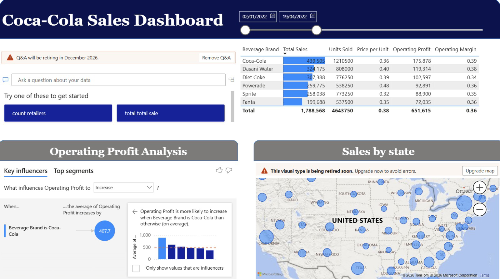
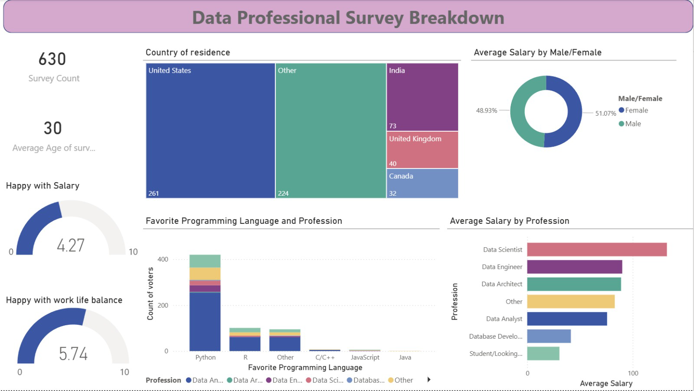
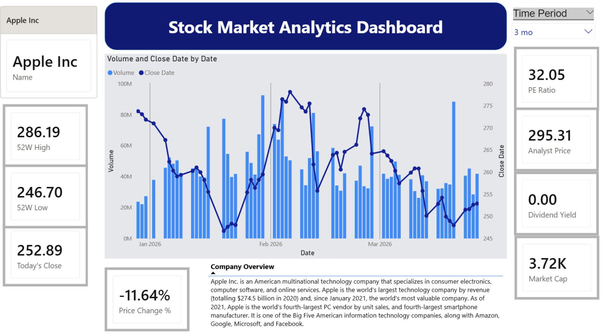

# Power BI Analytics

This project consists of three interactive Power BI dashboards developed to analyze business sales performance, workforce survey insights, and financial market trends. Each dashboard focuses on a different business domain and demonstrates data visualization, KPI analysis, and interactive reporting capabilities.

---

# Beverages Sales Performance Dashboard

## Project Overview
The Beverages Sales Performance Dashboard analyzes Coca-Cola sales data across multiple beverage brands in the United States. It provides insights into sales trends, profitability, product performance, and regional distribution, helping stakeholders understand business performance and operational efficiency.

## High-Level Requirements
- Analyze beverage sales performance across brands
- Track total sales, units sold, operating profit, and profit margin
- Compare product-level profitability
- Visualize sales geographically across states
- Identify key factors influencing operating profit
- Enable date-based filtering for time trend analysis

## Use Case
This dashboard is intended for sales managers, business analysts, and executives to evaluate beverage sales trends, identify profitable brands, and make data-driven business decisions.

## Data Architecture
The dashboard uses beverage sales transaction data containing:
- Beverage Brand
- Total Sales
- Units Sold
- Price per Unit
- Operating Profit
- Operating Margin
- State
- Date

## Data Shown
The dashboard includes:
- Beverage sales summary table
- Total sales by beverage brand
- Operating profit analysis using Key Influencers visual
- Sales by state map visualization
- Interactive date range slicer
- Q&A visual for ad hoc data questions

## Constraints & Limitations
- Dataset is static and historical only
- No real-time sales integration
- External business factors (weather, competition, promotions) are not included
- Map visual dependency may change due to Power BI feature retirement notices

## Future Enhancements
- Add sales forecasting for future months
- Include retailer-level drill-through analysis
- Integrate predictive demand trend modeling
- Add customer segmentation insights

---

# Data Professionals Survey Report

## Project Overview
The Data Professionals Survey Dashboard presents analysis of survey responses collected from global data professionals. It highlights workforce demographics, salary patterns, programming preferences, and satisfaction levels across different professional roles.

## High-Level Requirements
- Analyze salary distribution across professions
- Compare workforce demographics by country
- Identify favorite programming languages by role
- Measure salary satisfaction and work-life balance
- Show profession-wise salary comparison

## Use Case
This dashboard supports HR analysts, recruiters, students, and aspiring data professionals in understanding global workforce trends in the data industry.

## Data Architecture
The dashboard is built on survey response data containing:
- Survey Count
- Age
- Country of Residence
- Gender
- Profession
- Salary
- Favorite Programming Language
- Salary Satisfaction Score
- Work-Life Balance Score

## Data Shown
The dashboard includes:
- Total survey count KPI
- Average age KPI
- Country distribution treemap
- Gender salary comparison donut chart
- Salary by profession bar chart
- Programming language preference chart
- Salary satisfaction gauge
- Work-life balance gauge

## Constraints & Limitations
- Based on self-reported survey responses
- Sample size limited to available participants
- Represents only one survey period snapshot
- May not reflect real-time workforce market changes

## Future Enhancements
- Add career progression trend analysis
- Compare salary growth by years of experience
- Integrate future AI skill demand analysis
- Include certification and education impact studies

---

# Stocks Dashboard

## Project Overview
The Stocks Dashboard is an API-driven financial analytics dashboard built using Alpha Vantage stock market data. It provides stock trend analysis, trading volume monitoring, and company financial KPI reporting for selected stock tickers.

## High-Level Requirements
- Dynamically retrieve stock market data using ticker symbols
- Display price trends and trading volume over time
- Show company financial KPI indicators
- Present stock volatility and price movement insights
- Allow time-period filtering for stock trend analysis

## Use Case
This dashboard is designed for investors, financial analysts, and business users who want to monitor stock performance and evaluate company financial strength using interactive visual reports.

## Data Architecture
The dashboard integrates Alpha Vantage API endpoints:

### Time Series Daily
- Open
- High
- Low
- Close
- Volume
- Date

### Company Overview
- Company Name
- Description
- Market Cap
- PE Ratio
- Dividend Yield
- Analyst Target Price

### Derived Metrics (DAX Measures)
- Today?s Close
- 52-Week High
- 52-Week Low
- Price Change %
- Daily Range

## Data Shown
The dashboard includes:
- Selected company name card
- Ticker/company identifier card
- KPI cards:
  - Today?s Close
  - 52-Week High
  - 52-Week Low
  - PE Ratio
  - Dividend Yield
  - Analyst Price
  - Market Cap
  - Price Change %
- Combined stock price and volume trend chart
- Company overview description panel
- Time period slicer

## Constraints & Limitations
- Alpha Vantage free API has request rate limits
- One stock ticker analyzed at a time
- Ticker changes require manual refresh
- Some fields may return zero/null depending on API availability
- Real-time exchange latency may exist

## Future Enhancements
- Add multi-stock comparison analysis
- Enable real-time automatic refresh
- Integrate moving averages and RSI indicators
- Add stock alert notifications
- Improve dynamic ticker selection inside dashboard

---

