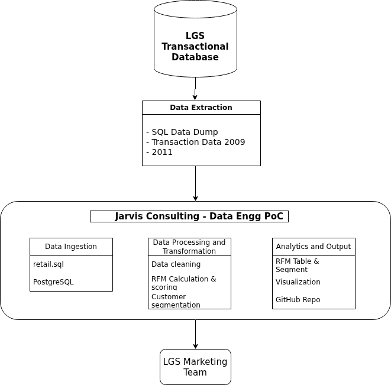

# Retail Data Analytics & Wrangling Project

## Introduction

London Gift Shop (LGS) is a UK-based online retailer specializing in giftware products. A large portion of its customer base consists of wholesalers who purchase in bulk. Although LGS has been operating its online store for over a decade, the company has experienced stagnant revenue growth in recent years.

To address this challenge, the LGS marketing team aims to leverage modern data analytics techniques to better understand customer purchasing behavior. However, due to limited IT capabilities within the marketing team and resource constraints in the internal IT department, LGS has engaged Jarvis Consulting to deliver a Proof of Concept (PoC) analytics solution.

From a business perspective, LGS (London Gift Shop) can use the analytical results of this project to better understand customer behavior, identify high-value customers, and design targeted marketing strategies. By applying data wrangling and RFM (Recency, Frequency, Monetary) analysis, the business can segment customers based on their purchasing patterns and improve customer retention and revenue growth.

The work in this project was implemented using **Python** within a **Jupyter Notebook**, leveraging data analytics and data wrangling techniques. Key Python libraries such as **pandas**, **numpy**, and **matplotlib/seaborn** were used for data cleaning, transformation, and analysis.

--

## Implementation

### Project Architecture

The architecture of this project follows a simple analytics pipeline:

1. **Data Source**  
   - Raw retail transaction data (CSV format)

2. **Data Wrangling & Processing**  
   - Data cleaning (handling missing values, data types, column formatting)
   - Feature engineering (line totals, recency calculation)
   - Aggregation at the customer level

3. **Analytics Layer**  
   - RFM metric calculation (Recency, Frequency, Monetary)
   - Customer segmentation based on RFM scores

4. **Consumption Layer (LGS Web App ? Conceptual)**  
   - The analytical results can be integrated into the LGS web application
   - Marketing and business teams can view customer segments and insights
   - Enables data-driven marketing campaigns and promotions

---

### Data Analytics and Wrangling
**Jupyter Notebook:**  
[Retail Data Analytics & Wrangling Notebook](./python_data_wrangling
/retail_data_analytics_wrangling.ipynb)

In the notebook, the following steps were performed:

1. Data exploration and cleaning
2. Standardization of column names
3. Calculation of transaction-level metrics
4. Creation of RFM metrics:
  - **Recency:** How recently a customer made a purchase
  - **Frequency:** How often a customer makes purchases
  - **Monetary:** How much money a customer spends
5. Customer segmentation using RFM scoring and quantiles
   
   Customers categorized into segments such as:
   - Champions
   - Loyal Customers
   - Potential Loyalists
   - At Risk
   - Hibernating

#### Business Value for LGS

Using the RFM analysis, LGS can:

- Identify **high-value and loyal customers** for exclusive offers
- Detect **at-risk customers** and design re-engagement campaigns
- Segment customers for personalized marketing strategies
- Optimize promotional spending by focusing on profitable segments

This data-driven approach helps LGS increase revenue while improving customer satisfaction and retention.

---

## Improvements

If given additional time and resources, the following improvements could be implemented:
1. Automated Data Pipeline
-  Build a scheduled ETL pipeline instead of manual SQL file ingestion.

2. Interactive Dashboard
- Develop a BI dashboard (e.g., Power BI / Tableau) for marketing teams.

3. Advanced Analytics
- Implement predictive modeling (Customer Lifetime Value, churn prediction).-
